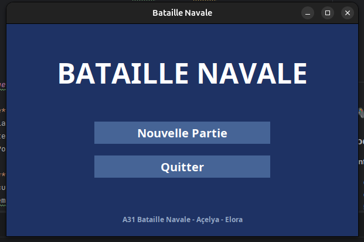
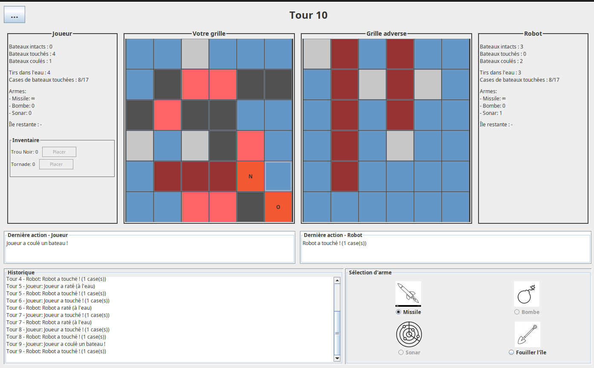
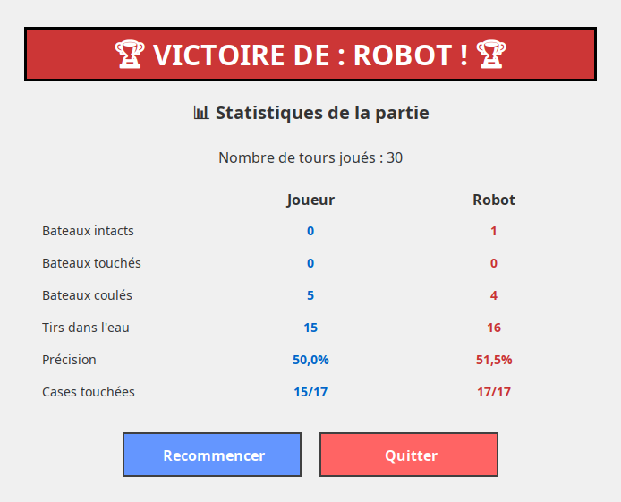

# ⚓ Bataille Navale - A31

> **Projet académique** - Jeu de stratégie tour par tour avec interface graphique complète en Java Swing

## À propos

Ce projet est une **implémentation complète du jeu Bataille Navale** développé dans le cadre du cours de conception orientée objet. Il propose une version enrichie du jeu classique avec des armes spéciales, des pièges tactiques et un mode île pour découvrir de nouvelles stratégies. Le jeu oppose un joueur humain à une intelligence artificielle avec deux niveaux de difficulté.

### Contexte du projet
- **Formation** : BUT2 Informatique - Module A31 - Conception et programmation orientée objet
- **Objectif** : Appliquer les principes SOLID et les patterns de conception dans un projet complet
- **Compétences** : Architecture MVC, patterns (Factory, Strategy, Observer), interfaces graphiques Swing

---

<p align="center">
  
  
  
</p>

---

## Fonctionnalités

### Mode de jeu classique

**Configuration flexible**
- Grilles de taille variable (6×6 à 10×10)
- Choix du nombre de bateaux (1 à 3 de chaque type, max 35 cases)
- 5 types de navires : Porte-avion, Croiseur, Contre-torpilleur, Sous-marin, Torpilleur

**Placement des bateaux**
- Mode manuel avec aperçu visuel (vert = valide, rouge = invalide)
- Mode aléatoire pour démarrer rapidement
- Validation en temps réel des positions

### Armes spéciales

| Arme | Description | Utilisation |
|------|-------------|-------------|
| **Missile** | Attaque une case unique | Usage illimité |
| **Bombe** | Touche 5 cases (centre + croix) | Usage unique |
| **Sonar** | Révèle le nombre de cases occupées dans un carré 3×3 | Usage unique (nécessite le sous-marin) |

### Pièges tactiques

| Piège | Effet | Stratégie |
|-------|-------|-----------|
| **Trou Noir** | Renvoie l'attaque sur la grille de l'attaquant | Placement défensif stratégique |
| **Tornade** | Modifie les 3 prochains tirs de l'adversaire vers des positions aléatoires | Perturbation tactique |

### Mode Île 

**Exploration et découverte**
- Zone 4×4 contenant des armes et pièges cachés
- Fouille case par case pour récupérer des bonus
- Inventaire dynamique pour stocker et utiliser les trouvailles
- Choix stratégique : attaquer l'ennemi ou explorer l'île ?

### Intelligence artificielle

**Deux stratégies disponibles**
- **Mode Aléatoire** : Tirs au hasard (niveau facile)
- **Mode Intelligent** : Traque systématique des bateaux touchés (niveau difficile)

### Interface graphique complète

**5 écrans fonctionnels**
1. **Menu principal** : Point d'entrée de l'application
2. **Configuration** : Paramétrage complet de la partie
3. **Placement** : Positionnement des éléments avec preview
4. **Partie** : Jeu avec statistiques temps réel et historique
5. **Fin de partie** : Résultats détaillés et options de recommencement

**Affichage enrichi**
- Grilles couleur avec légende explicative
- Statistiques en temps réel (bateaux touchés/coulés, précision, etc.)
- Historique des actions en 3 zones (joueur, robot, événements)
- Inventaire visuel des armes et pièges disponibles
- Dialogues contextuels pour les événements spéciaux

---

## Technologies utilisées

| Composant | Technologies |
|-----------|-------------|
| **Langage** | Java 11+ |
| **Interface graphique** | Java Swing |
| **Architecture** | MVC strict |
| **Patterns** | Factory, Strategy, Observer |
| **Build** | Compilation standard Java |

---

## Installation

### Prérequis
- **JDK** : Java 11 ou supérieur
- **IDE** : IntelliJ IDEA, Eclipse, ou VS Code (recommandé)
- **Système** : Windows, macOS, ou Linux

### Étapes d'installation

**1. Cloner le dépôt**
```bash
git clone https://github.com/votre-username/bataille-navale.git
cd bataille-navale
```

**2. Compiler le projet**
```bash
# Avec javac (ligne de commande)
javac -d bin -sourcepath src src/**/*.java

# Ou avec votre IDE préféré
# Ouvrir le projet et lancer la compilation
```

**3. Lancer l'application**
```bash
java -cp bin Main
```

---

## Guide d'utilisation

### Démarrer une partie

1. **Configuration**
  - Choisir la taille de grille (6×6 à 10×10)
  - Sélectionner le nombre de bateaux de chaque type
  - Activer ou non le mode Île
  - Choisir la stratégie du robot (aléatoire ou intelligent)

2. **Placement**
  - Placer manuellement vos bateaux en cliquant sur la grille
  - Utiliser la rotation pour changer l'orientation (horizontal/vertical)
  - Placer vos pièges stratégiquement (si disponibles)
  - Valider pour démarrer la partie

3. **Jouer**
  - Sélectionner une arme dans le panneau de sélection
  - Cliquer sur la grille adverse pour attaquer
  - Observer le résultat et les statistiques
  - Le robot joue automatiquement après vous

### Stratégies gagnantes

**Mode classique**
- Utiliser le sonar pour détecter les zones occupées
- Conserver la bombe pour les bateaux alignés
- Placer le trou noir près de vos gros navires

**Mode Île**
- Explorer l'île en début de partie pour récupérer des bonus
- Équilibrer entre exploration et attaque
- Utiliser l'inventaire pour placer des pièges trouvés

**Contre le robot intelligent**
- Espacer vos bateaux pour éviter la traque
- Utiliser les pièges de manière défensive
- Cibler méthodiquement zone par zone

---

## 🏗Architecture du projet

### Structure MVC stricte

```
src/
├── model/                      # Logique métier (aucun affichage)
│   ├── players/                # Joueurs et robot
│   │   ├── Player.java
│   │   └── Robot.java
│   ├── contents/               # Éléments du jeu
│   │   ├── fleet/              # Bateaux
│   │   ├── weapons/            # Armes (Factory)
│   │   └── traps/              # Pièges (Factory)
│   ├── grid/                   # Grille et cases
│   ├── game/                   # Logique de partie
│   │   ├── Game.java
│   │   ├── GameConfig.java
│   │   ├── GamePlacement.java
│   │   ├── GameStats.java
│   │   └── RobotStrategy/      # IA (Strategy)
│   └── enums/                  # Énumérations
│
├── controller/                 # Coordination Modèle ↔ Vue
│   ├── CentralController.java  # Navigation entre écrans
│   ├── ConfigurationController.java
│   ├── PlacementController.java
│   ├── GameController.java
│   └── EndController.java
│
├── view/                       # Interface graphique (aucune logique)
│   ├── dialogs/                # Dialogues réutilisables
│   ├── panels/                 # Composants modulaires
│   │   ├── GameGridPanel.java
│   │   ├── PlayerStatsPanel.java
│   │   ├── WeaponSelectionPanel.java
│   │   └── ActionHistoryPanel.java
│   ├── utils/                  # Utilitaires (couleurs)
│   ├── MenuView.java
│   ├── ConfigurationView.java
│   ├── PlacementView.java
│   ├── GameView.java
│   └── EndView.java
│
└── Main.java                   # Point d'entrée
```

### Patterns de conception appliqués

**Factory Pattern**
- `BoatFactory` : Création centralisée des bateaux
- `WeaponFactory` : Instanciation des armes selon le type
- `TrapFactory` : Génération des pièges

**Strategy Pattern**
- `RobotStrategy` : Interface pour les stratégies du robot
- `RandomRobotStrategy` : Tirs aléatoires
- `SmartRobotStrategy` : Traque intelligente des bateaux

**Observer Pattern**
- `Boat implements Observer` : Notification des changements d'état
- `Square implements Observer` : Mise à jour automatique de la vue
- `GameView implements Observer` : Réaction aux événements du jeu

---

## Concepts pédagogiques

Ce projet illustre plusieurs principes fondamentaux :

### Programmation orientée objet
- **Encapsulation** : Séparation stricte des responsabilités (MVC)
- **Héritage** : Hiérarchie Weapon, Trap, Content
- **Polymorphisme** : Stratégies du robot, factories
- **Abstraction** : Interfaces Observer, Strategy

### Principes SOLID
- **S**ingle Responsibility : Chaque classe a une responsabilité unique
- **O**pen/Closed : Extensible via stratégies et factories
- **L**iskov Substitution : Les stratégies sont interchangeables
- **I**nterface Segregation : Interfaces ciblées (Observer, Strategy)
- **D**ependency Inversion : Dépendances via interfaces

### Bonnes pratiques
- Validation centralisée dans le modèle
- Encapsulation des résultats (TurnResult, AttackResult)
- Réutilisation de composants (panels)
- Séparation configuration/placement

---

## Fonctionnalités bonus implémentées

Au-delà des exigences de base, nous avons ajouté :

 **Menu principal** avec design soigné

 **Système de légendes** pour comprendre les couleurs et abréviations

 **Triple mode de recommencement**
- Rejouer la même partie (mêmes placements)
- Nouveaux placements (même configuration)
- Nouvelle configuration complète

 **Inventaire dynamique** pour stocker les pièges trouvés sur l'île

 **Dialogues visuels avancés**
- Effets colorés (vert = bénéfique, rouge = néfaste)
- Résultat sonar avec grille 3×3 visuelle
- Choix lors de la découverte de pièges

 **Preview de placement** en temps réel (vert/rouge)

---

##  Limitations connues et améliorations futures

### Points à améliorer identifiés

**GameView (~400 lignes)**
- Pourrait bénéficier d'un pattern Mediator
- Extraction de la logique Observer dans une classe dédiée
- Découpage de la méthode `initComponents()`

**ConfigurationView**
- Méthode `initComponents()` trop longue (~150 lignes)
- Pourrait être découpée en sous-méthodes

**Optimisations**
- `onGridChanged()` redessine toute la grille (pourrait être partiel)
- Réutilisation du `BoatCustomizationDialog` au lieu de le recréer

### Ce que nous referions différemment

Avec du recul et plus de temps :
- Tests unitaires dès le début (JUnit)
- Système de logging professionnel (Log4j)
- Anticipation de la refactorisation des vues volumineuses
- Conception UML incluant les panels dès le départ
- Gestion des ressources avec `getResource()` pour les images

---

## Références

### Documentation Java
- [Oracle Java Swing Tutorial](https://docs.oracle.com/javase/tutorial/uiswing/)
- [Design Patterns en Java](https://refactoring.guru/design-patterns/java)

### Cours et ressources
- *Design Patterns: Elements of Reusable Object-Oriented Software* - Gang of Four
- *Clean Code* - Robert C. Martin
- *Head First Design Patterns* - Eric Freeman

---

## Auteurs

**Acelya Muharremoglu** - Développeur principal  
**Elora Fouilleul** - Développeur principal

*Projet réalisé dans le cadre du module A31 - Conception orientée objet*

---

## Licence

Projet académique - IUT/Université

---

**Bon jeu et que le meilleur stratège gagne ! ⚓🎯**